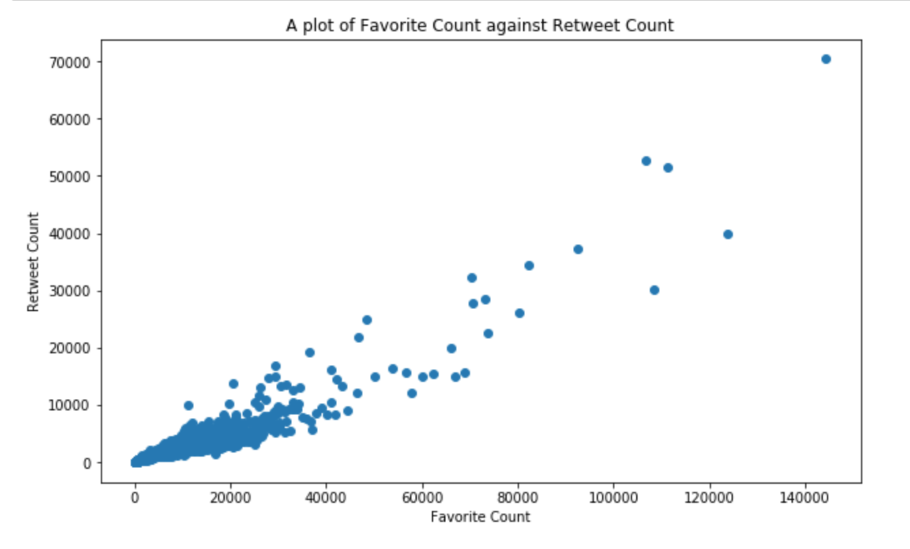

# Report on Analysis of Dog_Rates Tweets
### by Mary Etokwudo

This project is an analysis on the tweet archive of Twitter user [@dog_rates](https://twitter.com/dog_rates), also known as
[WeRateDogs](https://en.wikipedia.org/wiki/WeRateDogs). These tweets have ratings of people's dogs with a humorous comment about the dog. The ratings are mostly displayed as a fraction with a denominator of 10 or multiples of 10 and the numeration greater than the numerator, for instance 13/10.

The wrangling process is documented in a separate file named "wrangle_report.md". 

Below are the insights gotten from the analysis.

## Insights:

1. The top 5 breeds of the dogs are:
    a. Golden Retriever
    b. Labrador Retriever
    c. Pembroke
    d. Chihuahua
    e. Pug
2. 98% of the tweets were tweeted from an iPhone device, others were either sent from the
    web or from Tweet Deck.
3. 90% of the top 10 tweets (by retweet count and favorite count) were tweeted between
    afternoon and night.
4. The top 10 tweets (by retweet count and favorite count) have rating numerators above 10
5. 84% of the tweets were tweeted between afternoon and night.
6. For dog stages, 85% of the tweets don't have dogs stages but the ones that have are in the
    following percentages:
    a. 10% of the tweets show a pupper stage dog,
    b. 3% of the tweets show a doggo stage dog,
    c. 1.2% of the tweets show a puppo stage dog, while
    d. 0.4% of the tweets show a floofer stage dog.

## Visualization:

The image below shows the correlation betweenFavoriteCount and Retweet Count. We can see
a positive correlation here. This implies that the most favorite tweets were retweeted the most.

